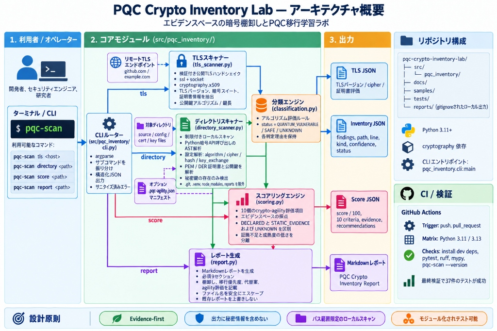
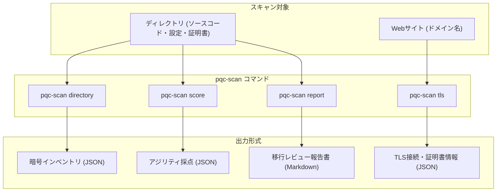

# PQC Crypto Inventory Lab

[](https://github.com/moruku36/pqc-crypto-inventory-lab/actions/workflows/ci.yml)
[](LICENSE)
[](pyproject.toml)

**ソフトウェアで使われている暗号方式を見つけ、「将来、どこを見直す必要がありそうか」を整理する学習用ツールです。**



たとえば、プログラムの中にRSAという暗号方式が使われていたら、その場所と見直す理由を記録します。
設定ファイルやWebサイトの通信で使われる暗号も、対応する範囲で調べられます。
調査結果を一覧表とレポートにまとめるところまでを、このプロジェクトで体験できます。

## 初めて読む方へ

まずは専門用語やソースコードを全部理解する必要はありません。次の順で読めます。

1. **[はじめての操作ガイド](docs/getting-started.md)**：付属サンプルを動かし、結果を開くまで。
2. **[結果の読み方](docs/reading-results.md)**：英語の項目名、判定、レポートを具体例で説明。
3. **[25点になる理由](docs/scoring.md#サンプルの25点を計算してみる)**：点数の内訳と、点数では分からないこと。
4. **[中の仕組み](docs/architecture.md)**：処理の流れを図で確認。
5. **[支援士学習ノート](docs/security-specialist-notes.md)**：操作した内容を試験の知識につなげる。

途中で知らない言葉が出たら、[用語の早見表](docs/glossary.md)を参照してください。
実行せずに確認する場合は、[付属レポート](samples/crypto_inventory_scored.md)を開けます。

## なぜ暗号を調べるのか

暗号は通信内容を隠したり、相手やデータが正しいことを確かめたりするために使います。
将来、十分な能力を持つ量子コンピューターが実現すると、RSAやECCなどの方式が影響を受けます。
そこで、量子計算による攻撃も考慮した方式への移行が検討されています。これが**PQC**です。

移行を考えるには、まず「どこで、何を、何のために使っているか」を知る必要があります。
この一覧作りを**暗号の棚卸し（Crypto Inventory）**と呼びます。
本ツールは、その調査の手掛かりを集めます。用途や稼働状態は、結果を見た人が追加確認します。

## 4つの機能

コマンドは、ターミナルという文字で操作する画面に入力します。
`pqc-scan`の後ろの単語で、実行する機能を選びます。

| コマンド | 調べるもの・すること | 結果 |
|---|---|---|
| `pqc-scan directory ./samples/project` | 付属ファイルの暗号利用を探す | 場所と方式の一覧 |
| `pqc-scan score ./samples/project` | 暗号を変更しやすい設計・運用の根拠を整理する | 10項目の点数と説明 |
| `pqc-scan report ./samples/project` | 棚卸しと採点を読み物にまとめる | Markdown形式のレポート |
| `pqc-scan tls github.com` | Webサイトとの暗号通信を確認する | 接続時に選ばれた方式や証明書情報 |



最初は`directory`から試すと、手元のサンプルと結果を見比べられます。
Codespacesでの「手元」はクラウド環境内です。Windowsのファイルを自動で調べることはありません。

## 結果を見るときの基本

| 表示 | このツールでの読み方 |
|---|---|
| `QUANTUM_VULNERABLE` | 将来の量子計算による攻撃に弱い方式。まず用途と移行の必要性を確認する |
| `SAFE` | 限定した方式・条件についての判定。システム全体が安全という意味ではない |
| `UNKNOWN` | 今回の情報・判定規則では結論を出せない。`reason`に書かれた理由を読む |

「見つかった」「実際に使われている」「安全に使われている」は別の判断です。
また、採点の25/100は合否や安全性の割合ではありません。[具体例](docs/reading-results.md)で確認できます。

---

以下は機能の詳しい仕様と、開発時の記録です。初回操作には上のガイドから進めます。

## 実装状況

Phase 0–5: CLI・CI・TLS・棚卸し・移行レポート・採点・支援士学習ノートを実装。

### 現在の検証状況（2026-09-15）

- リポジトリ: https://github.com/moruku36/pqc-crypto-inventory-lab
- 初期構成時点ではpytest 3件が成功。全機能実装後は37件・Ruff・mypyが成功（下記「最終検証」）。
- Windowsからの依存取得はTLSエラー。利用者の許可により検証・commit・pushを
  Codespacesへ移行。ここでいうローカルテストはクラウド開発環境内のテストです。
- 起動に空でないブランチが必要なため、READMEのみのbootstrap commitを先行。
- CI結果と各Phaseのcommitは最終IMPLEMENTATION_SUMMARY.mdに記録します。

## 開発環境

Python 3.11以上。

```sh
python -m venv .venv
# Windows: .venv\Scripts\activate
# POSIX: source .venv/bin/activate
python -m pip install -e ".[dev]"
pqc-scan --help
pqc-scan --version
python -m pytest -q
python -m ruff check .
python -m mypy
```

## 実装手順

各Phaseは実装、ローカルテスト、差分レビュー、文書更新、commit、push、
remote・branch・commit・working tree・反映確認、完了報告の順で進めます。

0. 初期構成
1. 公開TLSハンドシェイク情報の取得
2. 明示指定ディレクトリの暗号棚卸し
3. Markdown移行レポート
4. 根拠を示すCrypto Agility採点
5. 情報処理安全確保支援士の学習ノート

## 安全性と免責事項（Security & Disclaimer）

- **学習・事前調査目的のツール**: 本ツールは教育・学習・暗号移行の初期トリアージを目的としており、包括的な暗号監査、脆弱性診断、または安全性の証明を提供するものではありません。
- **公式認定・標準との関係**: NIST等の公的機関による認定ツールではありません。Crypto Agilityの採点やP1〜P3の優先度分類は本プロジェクト独自の学習用ヒューリスティックです。
- **秘密情報の非出力保証**: スキャナーは秘密鍵本文、トークン、パスワード等の機微情報を一切読み込まず、出力にも含めません（秘密鍵は存在検知のみ行います）。
- **非侵襲的なTLS観測**: TLSスキャンは通常の公開TLSハンドシェイクを1回のみ行い、不正なプロービングやダウングレード攻撃等は一切行いません。
- **レポートの共有**: ローカルスキャンのレポート（`reports/`）には社内ファイルの相対パス名が含まれ得るため、`.gitignore` で除外されています。外部共有前に内容を確認してください。
- **脆弱性報告**: 脆弱性やセキュリティ上の懸念を発見された場合は、公開Issueではなく [SECURITY.md](SECURITY.md) に記載の連絡先へご連絡ください。

[設計](docs/architecture.md) · [参照資料](docs/references.md) · [行動規範](CODE_OF_CONDUCT.md) · [貢献ガイド](CONTRIBUTING.md)

[実装サマリー・検証結果・各PhaseのGit履歴](IMPLEMENTATION_SUMMARY.md)

## TLSスキャン（Phase 1）

```sh
pqc-scan tls github.com --timeout 5
pqc-scan tls example.com --port 443
```

JSONでTLSバージョン、暗号スイート、証明書の署名・公開鍵・鍵長・有効期限、
取得可能な鍵交換ファミリーと理由を返します。TLS 1.3の鍵交換グループは
Python sslが公開しないためUNKNOWNです。接続は証明書の名前・信頼・期限を検証します。
失敗時は標準エラーに構造化JSONを出して終了コード1、引数エラーは2です。
DNS解決にはOS側の待ち時間があり、`--timeout`は全処理の厳密な上限ではありません。

SAFEは限定的なアルゴリズム評価で、システム全体の安全性を示しません。
SHA-1の古典的な弱点と量子脆弱性は区別します。CRL/OCSP検証は行いません。
実行例は`samples/tls-github.json`。ライブ値は実行日時・経路で変化します。
Phase 1検証: pytest 16件、Ruff、mypy成功。

## ディレクトリ棚卸し（Phase 2）

```sh
pqc-scan directory ./samples/project
pqc-scan directory ./project --max-files 5000
```

Pythonの暗号ライブラリAPI呼び出しをASTで解析し、設定のalgorithm/cipher/hash等の
既知キー、PEM・DER証明書、PEM/SSH公開鍵を解析します。RSA、ECDSA、ECDH、
Ed25519、X25519、SHA-1/256/384/512、AESを対象とします。
文字列・コメントにアルゴリズム名があるだけでは検出しません。
秘密鍵はヘッダーの存在のみを記録し、鍵のデコードや本文出力は行いません。

最大1 MiB/ファイル、最大10,000ファイル。シンボリックリンク・.git・仮想環境・
node_modules・reportsを除外します。.env等も除外し、読み取れないファイルはissuesに
固定理由を記録します。件数制限ではtruncated=trueを返します。
ファイル更新を止めた静的ディレクトリで実行してください。

相対パス自体は出力されます。共有前に機微なファイル名がないか確認してください。
検出ゼロは暗号不使用の証明ではありません。依存設定やPython以外のソースを含む
全言語・全形式の解析は未対応です。例: `samples/directory.json`。
Phase 2検証: pytest 21件、Ruff、mypy成功。

## 移行レポート（Phase 3）

```sh
pqc-scan report ./samples/project
pqc-scan report ./project --output reports/project-review.md
```

必須9章を含むMarkdownを生成します。既存ファイルは上書きしません。
`reports/`の既定出力はGit対象外。共有用の合成例は`samples/crypto_inventory.md`です。
P1はSHA-1用途・鍵保管の確認、P2は量子脆弱な公開鍵方式の用途・保持期間の調査、
P3はパラメータ等の確認という独自のトリアージです。NISTの義務・期限ではありません。
PQC候補は用途別の検討案で、ライブラリ・PKI・プロトコル対応の検証が必要です。
Phase 3検証: pytest 26件、Ruff、mypy成功。Phase 0–2のGitHub Actionsも成功確認済み。

## Crypto Agility Score（Phase 4）

```sh
pqc-scan score ./samples/project
```

10項目の点数・理由・根拠・改善案をJSONで出力し、reportにも組み込みます。
[採点基準とmanifest仕様](docs/scoring.md)を参照してください。
UNKNOWNは未評価、DECLAREDは運用側の申告で、実行検証済みという意味ではありません。
サンプルは25/100（静的根拠10点＋設計の申告15点）で、本番の成熟度評価ではありません。
出力例は`samples/score.json`と`samples/crypto_inventory_scored.md`。
Phase 4検証: pytest 35件、Ruff、mypy成功。

## 支援士学習ノート（Phase 5）

[セキュリティ技術と実装の対応](docs/security-specialist-notes.md)に、公開鍵・共通鍵・
ハイブリッド暗号、RSA/ECC、PKI/X.509、TLS、署名・ハッシュ・鍵交換・証明書、
CRL/OCSP、暗号移行、Crypto Agility、PQCを整理しました。
各項目に試験ポイント・実装箇所・実務用途・間違えやすい点を記載しています。

## 最終検証

Codespacesでpytest 37件、Ruff、mypy、CLI全コマンド、公開TLS取得、
ディレクトリ棚卸し、採点付きレポート生成が成功しました。
最終レビューでは、TLSの既知のAES-128/ChaCha20・ハッシュ表示を追加し、
未対応公開鍵方式をUNKNOWNにする処理と、エラーに秘密の詳細を含めない回帰検査を追加しました。
Phase 0〜5のGitHub Actionsはすべて成功確認済みです。

## ライセンス

このプロジェクトは [MIT License](LICENSE) の下で公開されています。
