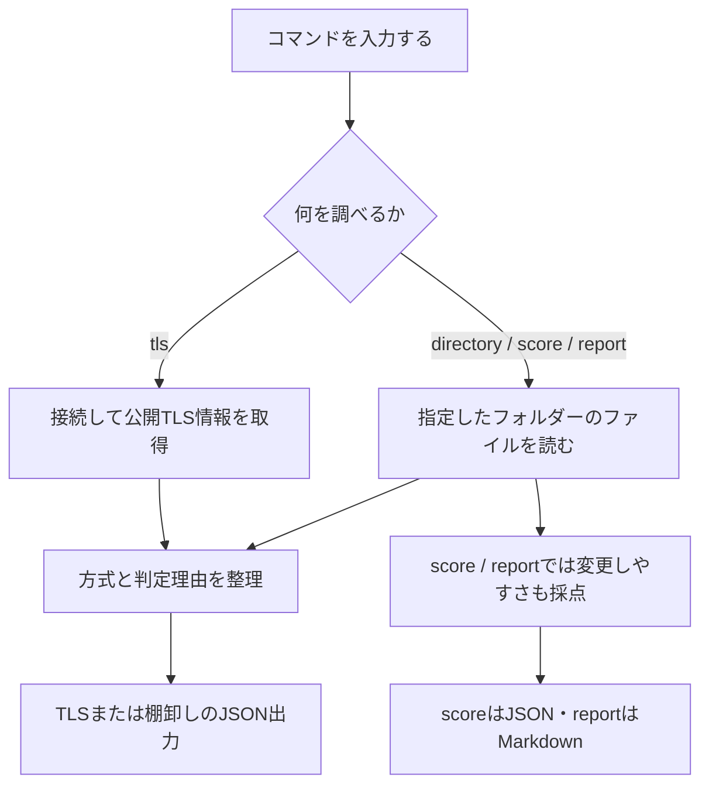

# Architecture

## まず、全体の流れ

このツールは「情報を集める」「その意味を分類する」「結果をまとめる」の3段階で動きます。
たとえるなら、調査票を集め、項目ごとに確認し、報告書にする流れです。

`report`が対象にするのはフォルダーです。TLSの実測結果をレポートに自動統合する機能はありません。

## ファイルと役割の対応

| ファイル | 役割 | 読むと分かること |
|---|---|---|
| `cli.py` | コマンドの受付係 | `tls`、`directory`などをどの処理に渡すか |
| `tls_scanner.py` | 通信の観測係 | 証明書や接続情報をどう取り出すか |
| `directory_scanner.py` | ファイルの調査係 | 読んでよい範囲、対応形式、検出方法 |
| `classification.py` | 方式の分類係 | なぜSAFEやUNKNOWNにしたか |
| `scoring.py` | 根拠を点数にまとめる係 | 自動検出と運用側の申告をどう区別するか |
| `report.py` | 報告書を作る係 | 一覧や理由を9つの章にどう並べるか |

たとえば`pqc-scan directory ./samples/project`では、`cli.py`が入力を受け取り、
`directory_scanner.py`がファイルを読みます。Pythonでは文章の単語検索だけでなく、
処理の構造（AST）を見て暗号ライブラリの呼出しを探します。
見つかった方式を`classification.py`の規則で分類し、結果をJSONとして返します。

## なぜ処理を分けたのか

暗号を見つける方法と、見つけた暗号を評価する規則は別々に改善できるためです。
たとえば新しい方式を分類に追加するとき、通信処理まで作り直さずに済みます。
通信を使わずに分類やレポートのテストを実行できることも利点です。

以下は、各部分の実装上の補足です。

## Phase 0

`src/pqc_inventory/cli.py`がargparseによるCLI入口です。
Phase 1からX.509解析にcryptographyを使用します。pytest、Ruff、mypyは開発用途です。
CIはPython 3.11および3.13で同じ検査を実行します。

## 共通の設計方針

TLS取得、ローカル解析、レポート、採点を独立したモジュールに分けます。
ネットワーク取得と判定を分離し、オフラインの単体テストを可能にします。
判定は観測値と理由を保持し、プロトコル名だけから鍵交換方式を推測しません。
ローカル解析は指定ルートに限定し、リンク追跡と生の内容出力を避けます。
採点は観測不足と低評価を区別し、基準・証拠・限界を公開します。

## TLS

`tls_scanner.py`: 標準ssl/socketで接続し、cryptographyでleaf証明書を解析。
公開鍵のEC符号化だけでは署名と鍵共有を区別できないため、表示はECCとします。
`classification.py`: アルゴリズム評価と判定理由。通信・出力から独立。
TLS 1.2のECDHE/DHEはスイートが示すファミリーのみ、グループは取得しません。
TLS 1.3のスイートは鍵交換を表さないためUNKNOWNです。

## Directory inventory

`directory_scanner.py`: 境界確認と制限付き読取 → 公開鍵/証明書の構造解析 →
Python AST/設定キー解析 → 値と理由だけのJSONを返します。
根拠は相対パス・行番号・検出種別。ソース断片や任意の設定値は保持しません。
ASTはimport aliasを解決しますが、再代入や動的dispatchは追跡しないため
API参照の信頼度はMEDIUMです。構造を解析できた公開鍵はHIGHです。
シンボリックリンクと特殊ファイルを除外し、lstat/fstatでファイル差替えを検出します。
同時にディレクトリ構造を変更する敵対的プロセスへの完全な防御は対象外です。

## Scoring and reporting

`scoring.py`はinventoryと任意の厳格な申告manifestを受け取り、10項目の
加算点・根拠の種類・理由・改善案を返します。証拠不足を実態の低評価と区別します。
`report.py`は固定の章と文言を使い、ファイル名のHTML/Markdown構文を無害化します。
レポートは排他的作成で既存ファイルを上書きしません。
詳細は[採点基準](scoring.md)。NISTが定義した点数ではありません。
