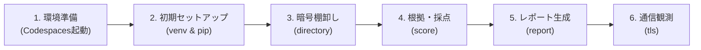

# はじめての操作ガイド

[READMEへ戻る](../README.md) · [次：結果の読み方](reading-results.md)

このガイドのゴールは、付属サンプルを調べて、レポートを1つ作ることです。
暗号方式を自分で実装する必要はありません。



## 1. 作業する場所を確認する

このプロジェクトでは、ブラウザから使える開発環境「GitHub Codespaces」を利用できます。
GitHubのリポジトリ画面にある **Code → Codespaces** から、このリポジトリの環境を開きます。
既存の環境があれば再開できます。画面の下部などにあるTerminal（ターミナル）で操作します。

以降のコマンドは**Codespaces内のターミナル**に入力してください。
WindowsのPowerShell向けのコマンドではありません。
Codespacesで編集するファイルや調べるフォルダーは、クラウド側にあります。

```sh
cd /workspaces/pqc-crypto-inventory-lab
ls
```

`cd`は作業フォルダーの移動、`ls`は中にあるファイルの一覧表示です。
README.md、pyproject.toml、samplesなどが見えれば、プロジェクトの入口にいます。
別の名前で配置した場合は、そのプロジェクトのフォルダーへ移動してください。

## 2. 最初の準備をする

```sh
python -m venv .venv
source .venv/bin/activate
python -m pip install -e '.[dev]'
pqc-scan --version
```

上から順に実行します。

| 行 | 何をしているか |
|---|---|
| `python -m venv .venv` | このプロジェクト専用のPython環境を作る。他の作業と必要な部品を分けるため |
| `source .venv/bin/activate` | これからその専用環境を使う、という切替 |
| `python -m pip install -e '.[dev]'` | ツール本体と、動作確認に使う部品をインストールする |
| `pqc-scan --version` | ツールを起動できるか確かめる |

最後に`pqc-scan 0.1.0`と表示されれば準備完了です。
すでに`.venv`があり準備済みなら、普段は`source .venv/bin/activate`から始められます。
新しいターミナルを開いたときは、環境の切替をもう一度行います。

## 3. サンプルの暗号を探す

```sh
pqc-scan directory ./samples/project
```

`directory`は「フォルダーを調べる」、`./samples/project`は調べるフォルダーの場所です。
`./`は現在の作業フォルダーを表します。
結果は、項目名と値を組にしたJSONという形式でターミナルに表示されます。

このサンプルでは、次の5件が見つかります。

| 場所 | 見つかるもの | 何の手掛かりか |
|---|---|---|
| `crypto_example.py`の13行目 | RSA | RSAの鍵を作る処理が書かれている |
| `crypto_example.py`の9行目 | SHA-1 | SHA-1を計算する処理が書かれている |
| `security.json` | AES-256 | 暗号方式として設定されている |
| `security.json` | X25519 | 鍵共有の方式として設定されている |
| `security.json` | SHA-384 | ハッシュ方式として設定されている |

行番号は現在の付属サンプルでの値です。ソースを編集すると変わります。
ここではファイルを読んでいるだけで、サンプルのPythonプログラムを実行しているわけではありません。
したがって「本番でもこの処理が呼ばれている」とまでは分かりません。

## 4. 点数と理由を見る

```sh
pqc-scan score ./samples/project
```

現在のサンプルは`score: 25`、`max_score: 100`になります。
暗号を変更しやすくするための設計や運用について、根拠を何点分集められたかを表します。
安全性が25%という意味ではありません。

`assessed_items: 6`は10項目中6項目について根拠または申告があるという意味です。
その6項目には0点の項目も含まれます。詳細は[25点の内訳](scoring.md#サンプルの25点を計算してみる)で確認できます。

## 5. 読みやすいレポートにする

```sh
pqc-scan report ./samples/project --output reports/first-review.md
```

`--output`の後ろは、レポートを保存する場所です。
成功すると`report_created`と保存先が表示されます。
Codespacesのファイル一覧で`reports`を開き、`first-review.md`を選びます。
Markdownのプレビューで開くと、見出しや表の形で読めます。

同じ名前のファイルがすでにある場合、上書きを防ぐためエラーになります。
もう一度作るときは、たとえば次のように名前を変えます。

```sh
pqc-scan report ./samples/project --output reports/second-review.md
```

まず「Executive Summary（概要）」で件数を確認し、次に「Cryptographic Inventory（一覧）」で
RSAやSHA-1の行を探してください。[各章の読み方](reading-results.md#レポートの9つの章)も用意しています。

## 6. Webサイトの通信も見る

サンプルの読み方が分かったら、次も試せます。

```sh
pqc-scan tls github.com --timeout 5
```

TLSはHTTPSなどで使われる暗号通信の仕組みです。
このコマンドは通常の接続を1回行い、選ばれた暗号方式や証明書を確認します。
接続先には`https://`を付けず、`github.com`のようにホスト名だけを指定します。
接続時刻や環境によって結果は変わるため、サンプルと完全一致する必要はありません。

TLS 1.3で`key_exchange`が`UNKNOWN`になるのは、このツールで取得できないためです。
接続の失敗や、暗号を使っていないことを意味しません。

## 7. 作業を終える

残したいレポートは保存先を確認してください。`reports/`はGitの追跡対象外なので、
コードをcommitしてもレポートが自動でGitHubへ保存されるわけではありません。
Codespacesを使い終わったら、環境を停止します。再開時には専用環境を有効にして続けます。

## よくあるつまずき

| 表示・状況 | 確認すること |
|---|---|
| `pqc-scan: command not found` | プロジェクト直下で`source .venv/bin/activate`を実行したか。未準備なら手順2へ |
| `INVALID_DIRECTORY` | フォルダー名が正しいか。CodespacesからWindowsのパスを直接指定していないか |
| `REPORT_WRITE_FAILED` | 同名のレポートがないか。別の出力名で試す |
| `AGILITY_MANIFEST_INVALID` | 採点用の申告ファイルと証拠パスが仕様どおりか。[仕様](scoring.md)を確認する |
| `TLS_CONNECTION_FAILED` | ホスト名、通信状態、待ち時間を確認する。まずフォルダーのサンプルで操作を確かめる |
| `CERTIFICATE_VERIFICATION_FAILED` | 接続先名・期限・信頼できる証明書かの検証に失敗した。証明書検証を無効にして進めない |
| `UNKNOWN`が多い | `reason`を読む。必要な情報が取得できない場合と、判定を限定している場合がある |

ここまでできたら、[結果の読み方](reading-results.md)を使って「見つかった事実」と「追加で調べること」を分けてみてください。
