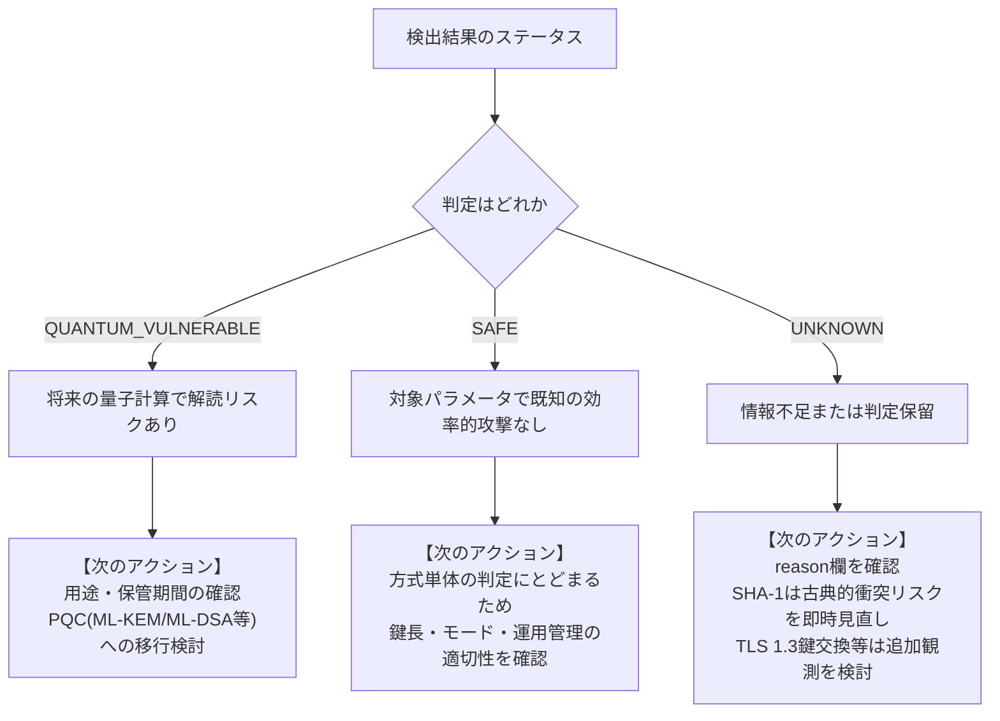

# 結果の読み方

[READMEへ戻る](../README.md) · [操作ガイド](getting-started.md)

結果を読むときは、**どこで見つかったか → 何が分かったか → 次に何を確認するか**の順に見ます。
英語の判定名をすべて覚える必要はありません。

## 1件の検出結果を読む

付属サンプルのRSA検出結果から、主要な項目を抜き出すと次のようになります。

```json
{
  "path": "crypto_example.py",
  "line": 13,
  "kind": "python_api_call",
  "confidence": "MEDIUM",
  "value": "RSA",
  "status": "QUANTUM_VULNERABLE"
}
```

日本語にすると、「crypto_example.pyの13行目に、RSAを扱うライブラリの呼出しが見つかった。
RSAは将来の量子計算による攻撃の影響を受ける方式」という意味です。

| 項目 | 意味 | この例では |
|---|---|---|
| `path` | 調べたフォルダーから見たファイルの場所 | `crypto_example.py` |
| `line` | 行番号。`null`は行番号を記録していないという意味 | 13行目 |
| `kind` | どのように見つけたか | `python_api_call`＝Pythonの処理の呼出し |
| `confidence` | 検出した根拠の確からしさ。安全性の強さではない | `MEDIUM`＝利用の手掛かりだが実行状況は未確認 |
| `value` | 見つけた方式 | RSA |
| `status` | このツールの量子リスク分類 | `QUANTUM_VULNERABLE` |
| `reason` | その分類にした理由。上の抜粋では省略 | 十分な量子計算能力を想定した場合の弱点を説明 |

公開鍵を構造として解析できた場合は`HIGH`になります。
HIGHでも、その鍵が適切に管理されていることや、システム全体が安全であることは証明しません。

## 判定ごとに、次にすること



### QUANTUM_VULNERABLE：用途と移行条件を調べる

RSAやX25519などに出ます。「現在すでに破られている」という意味ではありません。
どの処理で使っているか、守るデータを何年秘匿したいか、移行先を使えるかを確認します。

たとえばRSAが見つかっても、署名に使っているのか、鍵確立に関係するのかで検討する方式が変わります。
レポートが用途確認を求めるのは、この違いを自動で断定できないためです。

### SAFE：判定の範囲を確認する

サンプルのAES-256やSHA-384はSAFEになります。
これは方式についての限定的な評価です。鍵が漏れていないか、設定が正しいか、
実装に問題がないかまで調べた結果ではありません。

### UNKNOWN：reasonを読む

UNKNOWNには複数の理由があります。

| 例 | UNKNOWNになる理由 | 次に確認すること |
|---|---|---|
| TLS 1.3の鍵交換 | Pythonの標準TLS機能から交渉グループを取得していない | 必要なら対応した別の観測手段を検討する |
| AESという名前だけ | 鍵長などが不明 | 実際の設定とパラメータ |
| SHA-256 | このツールの限定した分類規則ではSAFEを付けない | 用途と必要な安全性。SHA-256が直ちに危険という意味ではない |
| SHA-1 | 量子分類と、既存の衝突に関する弱点を分けている | 改ざん検知や署名など、衝突への強さが必要な用途か |

特にSHA-1は、UNKNOWNだから後回しにしてよいわけではありません。
レポートでは、量子計算とは別に既存の弱点を確認する対象として扱います。

## 棚卸し全体の項目

| 項目 | 意味 |
|---|---|
| `files_scanned` | 対応する形式として、正常に読取・解析できたファイル数 |
| `scanned_paths` | そのファイルの相対パスの一覧 |
| `findings` | 暗号利用などの検出結果。1ファイルから複数件見つかることもある |
| `issues` | 読取・解析の失敗や、一部の除外についての記録 |
| `truncated` | `true`なら件数制限で調査を途中までにした |
| `limitations` | 解析できる範囲の限界 |

`findings`が空でも、「暗号を一切使っていない」とは言えません。
対応外の言語・形式、動的に選ばれる方式、除外フォルダーなどは調べ切れていないためです。
`issues`が空でも、全ファイルを検査したとは限りません。

## TLSの結果を読む

TLSの結果は「今回の1回の接続で観測できたもの」です。

| 項目 | 読み方 |
|---|---|
| `tls_version` | 通信ルールの版。例：TLSv1.3 |
| `cipher_suite` | 今回選ばれた暗号処理の組合せの名前 |
| `symmetric_cipher` | 通信本文を保護する共通鍵方式 |
| `cipher_hash` | スイート名から読み取れるハッシュ方式 |
| `certificate.public_key` | 証明書に入っている公開鍵の方式 |
| `certificate.public_key_size_bits` | その公開鍵のサイズ。方式の違う鍵長を単純比較しない |
| `certificate.signature` | 証明書への署名の方式。上の公開鍵方式とは別の項目 |
| `certificate.expiration` | 証明書の期限。`+00:00`はUTC時刻であることを表す |
| `key_exchange` | 共有する秘密を決める方式について、取得できた情報 |

`TLS_AES_128_GCM_SHA256`という名前ならAES-128やSHA-256は読み取れますが、
TLS 1.3の鍵交換方式まではこの名前から分かりません。
また、証明書がRSAでも、通信本文をRSAで暗号化しているとは限りません。

## レポートの9つの章

| 英語の見出し | 日本語でいうと | 最初に見るところ |
|---|---|---|
| Executive Summary | 概要 | 調査件数、検出件数、部分的な結果か |
| Cryptographic Inventory | 暗号の一覧 | ファイル・方式・根拠 |
| Quantum Vulnerability | 量子計算に対する弱点 | 判定理由 |
| Migration Priority | 見直しの順序 | P1/P2/P3の確認事項 |
| Recommended PQC Replacement | 移行候補 | 署名用と鍵確立用を区別しているか |
| Crypto Agility Assessment | 暗号を変更しやすいかの評価 | 点数だけでなく根拠とUNKNOWN |
| Findings | 調査中に分かった問題や除外 | 読めなかったファイルなど |
| Limitations | この調査で分からないこと | 調べ残しを理解する |
| References | 参照資料 | 判断の背景となる資料 |

P1はSHA-1の用途や秘密鍵の保管状況など、先に確認したい事項です。
P2は量子脆弱な方式の用途・データ保持期間・移行の依存関係、P3はパラメータ等の確認です。
この順序は学習用の目安で、実際の対応期限や事業上の優先順位を決定するものではありません。

## サンプルを使った確認メモ

結果から、たとえば次のようなメモを作れます。

| 観測したこと | まだ分からないこと | 次の確認 |
|---|---|---|
| `crypto_example.py`にRSAの鍵生成処理がある | この関数が実際に使われるか、何に使う鍵か | 呼出し元と設計を読む |
| `security.json`にX25519がある | 設定が実際の通信に反映されるか | 設定読込処理と通信の実測を確認 |
| SHA-1の処理がある | 衝突への強さが必要な用途か | 入出力と利用目的を確認 |
| 採点が25点だった | 残りの運用がないのか、根拠が不足しているのか | [内訳](scoring.md#サンプルの25点を計算してみる)でUNKNOWNを確認 |

このように、調査結果を次の確認作業につなげることが、このツールの主な使い方です。
