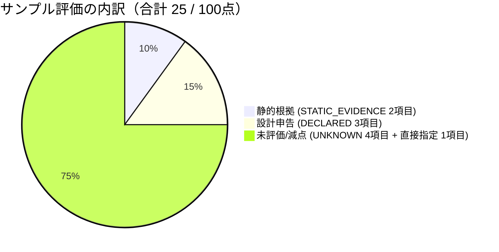
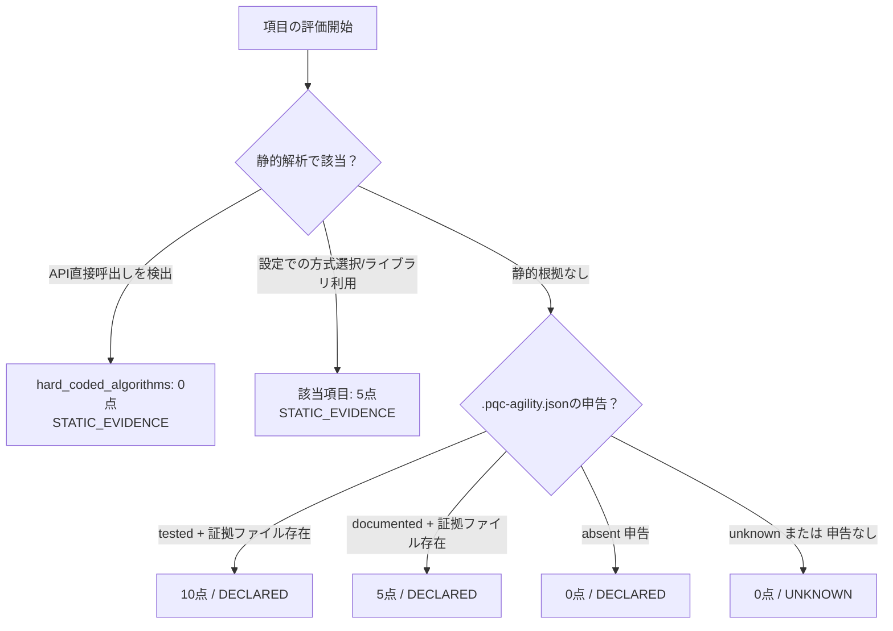

# Crypto Agility scoring rubric

これは独自の「確認できた静的根拠＋運用側が申告した成熟度」の点数です。
実測の安全性、PQC準拠、NISTの公式スコアではありません。

## 何を採点しているのか

ここで知りたいのは「暗号を変更する必要が生じたとき、変更する準備がどの程度見えるか」です。
たとえば暗号方式がプログラムの多数の場所に直接書かれていると、変更箇所の調査が必要です。
一方、設定や共通の部品を通じて切り替えられれば、変更をまとめやすくなります。

ただし、ファイルを読むだけでは鍵更新や証明書更新の実際の運用は分かりません。
そこでこのツールは、見つけられた根拠と、利用者が申告した内容を別の印で表示します。

| 表示 | 日本語での意味 |
|---|---|
| `STATIC_EVIDENCE` | ファイルから、判断の手掛かりを見つけた |
| `DECLARED` | 利用者が「文書化した」「テストした」などと申告した |
| `UNKNOWN` | 判断するための根拠が不足している |

これは量子リスクのSAFE/QUANTUM_VULNERABLEとは別の分類です。
RSAが量子脆弱でも、その方式を交換しやすい仕組みを用意することはできます。

## サンプルの25点を計算してみる

```sh
pqc-scan score ./samples/project
```

| 評価すること | 点数 | 根拠・読み方 |
|---|---:|---|
| 方式の直接指定 | 0 | 暗号APIの呼出しを検出。ラッパー内の呼出しかどうかは人が確認する |
| 方式を交換するための共通の窓口 | 5 | `agility_design.txt`に設計を記載した、という申告 |
| 鍵の集中管理 | 0 | UNKNOWN。集中管理していないと断定したわけではない |
| 証明書の発行・配布の自動化 | 0 | UNKNOWN |
| 鍵の定期更新 | 5 | 設計の記載についての申告。実行済みの確認ではない |
| 暗号ライブラリの利用 | 5 | Pythonの暗号API利用を検出。保守状況までは未確認 |
| 通信方式の安全な交渉 | 0 | UNKNOWN |
| 設定による方式の選択 | 5 | `security.json`に方式を指定している。実際の反映は未確認 |
| 証明書の更新・失効等の自動化 | 0 | UNKNOWN |
| 更新・切戻しの準備 | 5 | 設計の記載についての申告 |
| **合計** | **25** | **静的根拠10点＋設計についての申告15点** |



この例では、根拠がある6項目のうち1項目が0点、5項目が5点です。
残り4項目はUNKNOWNなので、`assessed_items`は6になります。
`declared_items`の3は、そのうち3項目を申告によって評価したという意味です。

点数を見た後は、UNKNOWNについて実際の運用資料を確認します。
点数を上げるために申告を書き換えるだけでは、設計や運用は改善しません。
特に`tested`の申告をツールが独立に検証することはありません。

## 計算

10項目×最大10点。合計は各項目の単純和で0〜100点です。
UNKNOWNの0点は根拠不足であり、「能力がない」という判定ではありません。
合計と一緒にassessed_items/10・declared_items・partial_inventoryを確認します。
同じ対象範囲・根拠の質でなければ、他プロジェクトと単純比較できません。

| 根拠 | 点 | 出力 |
|---|---:|---|
| 根拠なし、またはunknown申告 | 0 | UNKNOWN |
| absent申告 | 0 | DECLARED（運用側の申告） |
| documented申告＋読取対象内の証拠ファイル | 5 | DECLARED |
| tested申告＋読取対象内の証拠ファイル | 10 | DECLARED。テスト内容は本ツールでは実行・検証しない |
| 設定の暗号選択またはPython暗号API利用を検出 | 該当項目に5 | STATIC_EVIDENCE。稼働状態・保守性は未検証 |
| 明示的なPython暗号API呼び出しを検出 | hard_coded_algorithmsを0 | STATIC_EVIDENCE。肯定的申告より優先。ラッパー内部の呼出しの可能性は人が確認 |



自動評価はhard_coded_algorithms、cryptographic_library_dependency、
configuration_driven_selectionだけです。他の項目をキーワード一致で推定しません。

## 10項目

| 識別子 | 確認したい能力 |
|---|---|
| hard_coded_algorithms | 呼出し元が固定アルゴリズムに依存せず切替可能か |
| algorithm_abstraction | 暗号プロバイダ/APIの抽象化 |
| centralized_key_management | KMS/HSM、鍵の所有・アクセス管理 |
| certificate_automation | 証明書の発行・配布の自動化 |
| key_rotation | 鍵更新、重複期間、廃止と復旧 |
| cryptographic_library_dependency | 暗号ライブラリ依存と保守計画 |
| protocol_negotiation | 認証された交渉、ダウングレード耐性 |
| configuration_driven_selection | ポリシー検証付きの設定選択 |
| certificate_lifecycle_automation | 更新、期限監視、失効の運用 |
| upgradeability | 互換性試験とロールバックを伴う移行 |

## 任意の運用根拠ファイル

初めて試す場合は、このファイルを自分で作る必要はありません。付属サンプルには用意済みです。
自分のプロジェクトを評価するとき、ファイルから分からない運用を補足するために使います。

対象ルート直下に`.pqc-agility.json`を置けます。省略すると自動評価のみです。

```json
{
  "version": 1,
  "criteria": {
    "key_rotation": {
      "level": "documented",
      "evidence": ["rotation-plan.txt"]
    }
  }
}
```

levelはunknown/absent/documented/tested。未対応の項目・スキーマはエラーにします。
documented/testedには1〜20個の根拠パスが必要です。スキャンで正常に読み取った
相対パスのみを許可し、対象外・秘密鍵ファイル・manifest自身は拒否します。
ファイルの存在を確認するだけで、その記述の真実性は保証しません。
根拠として扱う運用文書は対応する.txt/.json等で用意してください。
合成サンプルは「設計の記載」の申告であり、本番運用や試験成功を主張しません。

設計上の背景: [NIST CSWP 39upd1](https://csrc.nist.gov/pubs/cswp/39/upd1/considerations-for-achieving-crypto-agility/final)。
